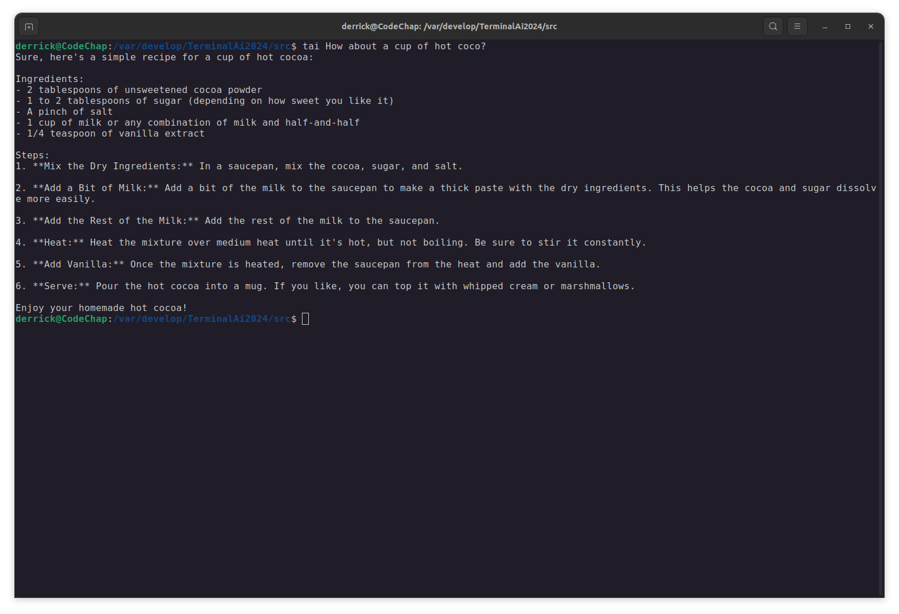

# Tai - Terminal AI Integration Documentation

Welcome to Tai - your gateway to harnessing the power of OpenAI's GPT-4 directly from your Linux terminal. Tai streamlines your workflow by providing instant AI assistance without the need for a web browser or graphical interface.

## Getting Started with Tai

### Prerequisites

 - A Linux-based operating system with terminal access
 - An active internet connection to communicate with OpenAI's API
 - An OpenAI API key

## Installation Instructions

To get Tai up and running on your system, follow these steps:

1. Download the Tai Executable

    Grab the latest version of the Tai.phar executable file from the official repository:

    [Tai.phar](https://github.com/codeChap/TerminalAi/blob/main/src/Tai.phar)

2. Make Tai Executable

    Assign execution permissions to the downloaded .phar file using the following command:

    ```
    chmod u+x /path/to/Tai.phar
    ```

    Ensure you replace /path/to/ with the actual directory path where Tai.phar is located.

3. Create a Symbolic Link

    Create a symbolic link to the Tai executable from a directory in your PATH, such as /usr/local/bin/, for easy access:

    ```
    ln -s /path/to/Tai.phar /usr/local/bin/tai
    ```

    Replace /path/to/ with the directory path containing the Tai.phar file.

4. Install Tai

    Initialize Tai by running the install command, which sets up the necessary configuration files:

    ```
    tai install
    ```

    During the installation process, Tai will prompt you to create a directory at ~/.config/tai for storing your conversations and OpenAI API key.

    Configure OpenAI API Key

    You will need to input your OpenAI API key when prompted. Your key will be securely stored in the OpenAi.key file within the configuration directory. You can edit this file directly to update your key if necessary.

## Utilizing Tai

To interact with the AI, simply type tai followed by your query:

```
tai "Could you assist me with Python debugging?"
```



## Available Commands

* tai clear - Resets your conversation history, allowing for a fresh start.
* tai help - Displays the help information and available commands.
* tai install - Sets up the initial configuration and API key handling.

(More to be added in time)

## Motivation

The inspiration behind Tai is to offer terminal enthusiasts a hassle-free method to leverage AI capabilities. Tai delivers AI responses at your command line fingertips.


## License

This project is open-sourced under the **MIT License**. For more details, please refer to the LICENSE file in the repository.

*For any additional questions or contributions, feel free to open an issue or submit a pull request in the Tai GitHub repository. Enjoy your journey with terminal-based artificial intelligence!*